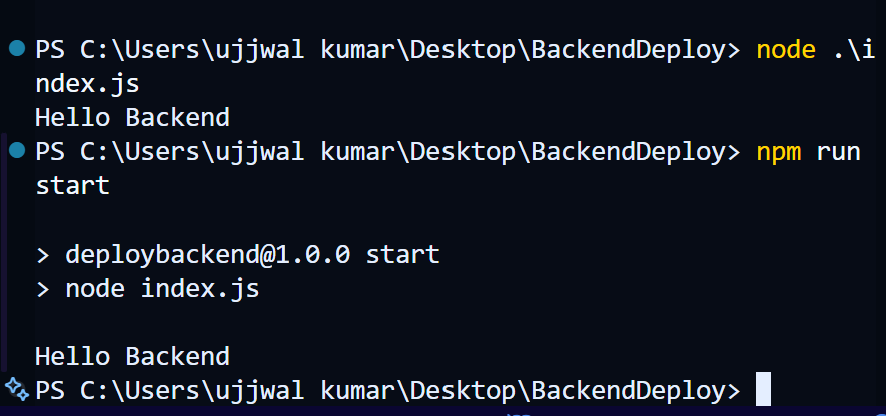

# Backend Deploy Notes
## first  of all we need to update the nodejs
## then we shold install the empty node ki application 
`npm init`
## iska matlab hai ki node package manage se ek app initilize kar do

```jsx
PS C:\Users\ujjwal kumar\Desktop\BackendDeploy> npm init
This utility will walk you through creating a package.json file.
It only covers the most common items, and tries toguess sensible defaults.

See `npm help init` for definitive documentation on these fields and exactly what they do.

Use `npm install <pkg>` afterwards to install a package and save it as a dependency in the package.json file.

Press ^C at any time to quit.
package name: (backenddeploy) deployBackend
Sorry, name can no longer contain capital letters.
package name: (backenddeploy) deploybackend
version: (1.0.0) 
description: a basic app for deploy the first backend project
entry point: (index.js) 
test command: 
git repository: 
keywords: backend deploy stomstunner first
author: ujjwal singh
license: (ISC) 
type: (commonjs) module
About to write to C:\Users\ujjwal kumar\Desktop\BackendDeploy\package.json:

{
  "name": "deploybackend",
  "version": "1.0.0",
  "description": "a basic app for deploy the firstbackend project",
  "main": "index.js",
  "scripts": {
    "test": "echo \"Error: no test specified\" && exit 1"
  },
  "keywords": [
    "backend",
    "deploy",
    "stomstunner",
    "first"
  ],
  "author": "ujjwal singh",
  "license": "ISC",
  "type": "module"
}


Is this OK? (yes) yes
PS C:\Users\ujjwal kumar\Desktop\BackendDeploy> 
```

---
## now we make our custom made script where we write the start in the cript and there value is node index.js 
## jisse bass jab ham `npm run start` chalenge toh hamra direct index.js chal jayega



---

## now we install the express for backend 
`npm install express`


---
## we copy the code from the express then copy and paste in the index file
```js
const express = require('express');
const app = express()
const port = 3000

app.get('/', (req, res) => {
  res.send('Hello World!')
})

app.listen(port, () => {
  console.log(`Example app listening on port ${port}`)
})
```